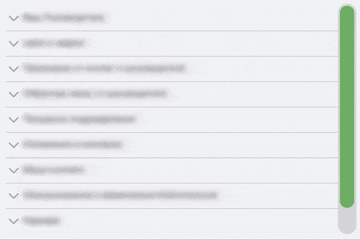

# happy-svelte-scrollbar

Custom scrollbar component for Svelte




* Cross-browser (tested on Chrome/Opera/FF; Safari and iOS Safari; IE 10+);
* lightweight and easy-to-use; 
* highly customizable.

### How to use? 

Import component inside yours component: 
```javascript
import Scrollbar from 'happy-svelte-scrollbar';
```
Near your scrollable area place a component and pass two props:

```sveltehtml
<div class="my-scroller" bind:this={ iAmScrollArea }>
    <div class="dynamic-content" bind:this={ iChangeMyHeight }>...</div>
</div>
<Scrollbar 
    observerTarget={ iChangeMyHeight } 
    scrollArea={ iAmScrollArea }
    showArrows={ true }
    buttonPressingMove={ 10 }
/>
```

For UX reasons component watches on height changes from `dynamic-content` element, so you should 
pass it as a prop to Scrollbar component. `my-scroller` element is also required, because Scrollbar
should apply scroll action on something. 

`observerTarget` and `scrollArea` can be both HTML-elements and Svelte components. If they are Svelte components, 
you should add these methods inside each of them:
```javascript
// observerTarget
export function happyObserverTarget() {
    return divNode; // bind it with bind:this in your markup
}

// scrollArea
export function happyScrollArea() {
    return divNode; // bind it with bind:this in your markup
}
```

Up and down arrows are available from version v1.1.0. 
Use the `showArrows` prop to control visibility. 
The `buttonPressingMove` prop can control 
the speed at which the block will be scrolled by the 
buttons. 

### Under the hood
`happy-svelte-scrollbar` uses:
* In modern browsers: `ResizeObserver` API;
* in legacy browsers: custom wrapper over `requestAnimationFrame`. 

### TODO
* Horizontal orientation (for now vertical only)

#### Contributing and issues report are welcome! 